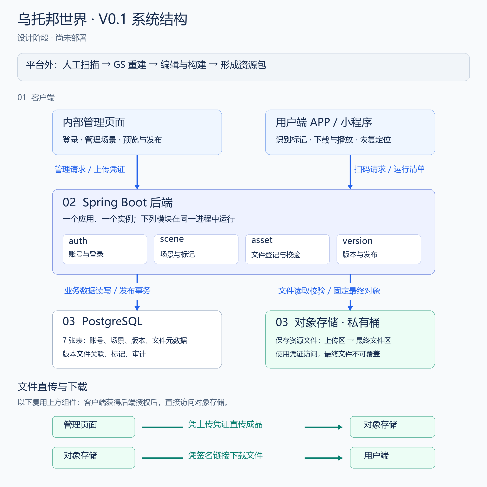

# V0.1 架构与职责

> 2026-09-16 更新：当前选择内网本地文件存储，Windows Docker 开发、后续 Linux 部署。本轮仅实现基础设施，见 [实施说明](10-local-infrastructure.md)。下文的云对象存储、昼夜、坐标与多平台清单属于历史候选设计，等待真实产物和客户端体验确认，不直接实施。

## 当前实现边界

当前 Demo 已实现账号、场景和审计；文件、版本、标记和游客读取仍是候选方案。[启动与维护](08-demo-runbook.md)为当前工程入口。

## 服务范围

平台负责场景管理、昼夜内容版本、文件登记、预览发布和扫码清单。扫描、GS 重建、场景编辑和资源构建由团队在外部工具中完成。

后台使用一个 Spring Boot 应用。管理员拥有相同权限，可以管理全部场景。当前范围不包含自动重建、任务队列、多租户、审批流程或多人实时互动。

## 系统结构



[查看矢量图](images/architecture-v0.1.svg)。上半部分的箭头表示调用方向，接口响应沿原路返回；下半部分的箭头表示文件传输方向。

从上到下分别是客户端、单个后端应用和数据存储。后端内部的四个方框是功能包，均运行在同一个进程中。PostgreSQL 保存业务数据和文件元数据，对象存储保存实际资源文件。

文件传输单独列在图底部，复用上方的管理页面、用户端和对象存储。管理员取得上传凭证后直传成品，用户端取得清单中的签名链接后直接下载。后端仍需读取上传文件进行校验。


对象存储承担文件上传和下载，数据库保存文件元数据及场景关系。这样可以避免大文件占用数据库，并减少经过应用服务器的下载流量。是否接入 CDN，由实际包体、下载量和访问地点决定。

## 技术栈与代码组织

| 用途 | 选择 | 原因 |
|---|---|---|
| 应用 | Java 21、Spring Boot、Spring MVC、Maven | 适合单应用的 HTTP 接口开发 |
| 数据访问 | PostgreSQL 17、MyBatis | 使用关系约束和事务维护版本一致性 |
| 数据库初始化 | Flyway | 按顺序执行数据库脚本 |
| 后台鉴权 | Spring Security、Token、Redis | 满足内部账号登录与统一权限要求 |
| 文件管理 | 云厂商对象存储 SDK | 签发上传凭证、读取并验证文件 |
| 测试与监控 | JUnit 5、PostgreSQL 集成测试、Actuator、日志 | 分别检查业务规则、数据约束和运行状态 |

应用沿用若依模块组织，`ruoyi-ar` 管理场景与业务审计。首期单实例，登录状态保存在独立 Redis，账号与权限使用固定管理员角色。文件与版本模块尚未实现。

Spring Boot 3.5.16、Java 21 已完成本机编译验证；固定来源见[适配记录](09-upstream-adaptation.md)。对象存储厂商待确认。

## 客户端与定位约定

每个内容版本按 Android、iOS、小程序保存平台配置和文件集合。具体资源格式需要与客户端确认，不能假定小程序能够直接加载 Unity 资源包。

二维码编号用于查找场景，三维姿态由客户端识别标记获得。后端提供标记尺寸和变换，定位稳定性需要在真实设备上验证。播放开始后固定 `versionId`，定位丢失后重新扫码时继续请求该版本。

同一场景的坐标原点保持固定。标记安装参数和尺寸不可修改；需要调整安装位置时创建新标记。内容需要采用新的坐标原点时创建新场景。

坐标暂定使用米、Y 轴向上、左手系和 `[x,y,z,w]` 四元数。标记局部 X 轴向右、Y 轴向上、Z 轴朝图案正面。`sceneFromMarker` 表示标记坐标到场景坐标的变换。客户端转换 SDK 坐标后，按以下关系计算：

```text
worldFromScene = worldFromMarker × inverse(sceneFromMarker)
```

上述坐标约定需要在首次客户端联调时确认。
