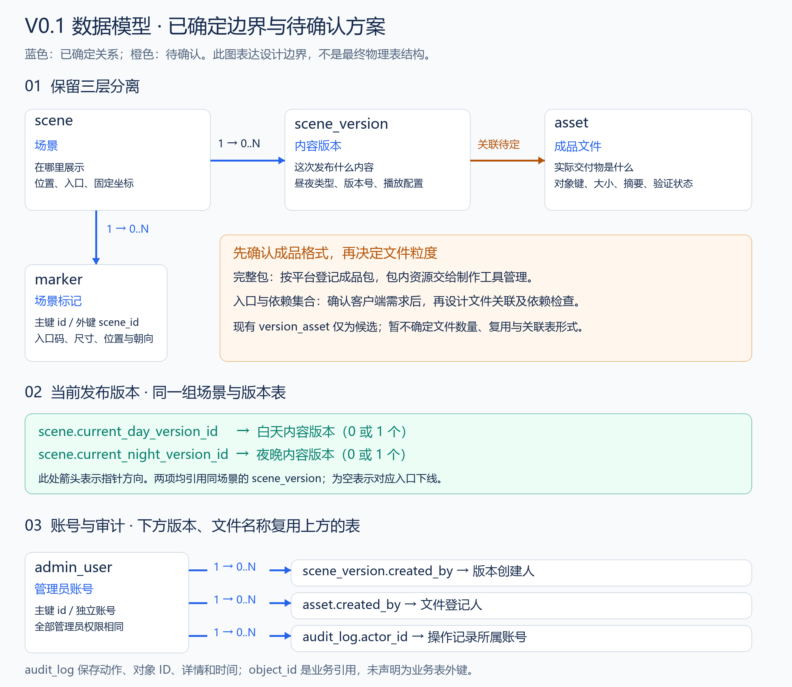

# V0.1 数据库设计

> 2026-09-16 更新：当前仅实施[内网本地存储基础设施](10-local-infrastructure.md)，没有新增业务表。下文昼夜、坐标、对象存储和文件关联保持历史候选状态，待真实成品与体验方案确认后统一修订。

> 本文保留 V0.1 候选设计与历史评审安排。当前 Demo 使用独立迁移，已实现范围以 [启动说明](08-demo-runbook.md) 为准；资源与发布流程尚未实现。

## 已确定的边界与待确认事项

已确定保留“场景—内容版本—成品文件”的分离。文件管理粒度待成品交付格式确认后决定；当前 SQL、接口与关系图中的多文件关联是候选方案，不代表必须逐个管理模型、音频等内部资源。

场景保存位置与入口，内容版本固定一次发布的内容，成品文件保存实际交付物。交付物可能是每平台一个完整包，也可能是入口文件加依赖文件集合，需要通过真实成品及客户端加载方式确认。

`version_asset` 的保留形式、`logical_path`、入口和依赖检查、跨版本文件复用均随交付格式评审。确认前不实现通用资源管理或包内依赖解析；账号、场景及标记工作可继续。

## 设计关系图

[查看矢量图](images/database-v0.1.svg)。蓝色表示已确定关系，橙色表示待确认内容。场景到内容版本是一对多关系；版本到成品文件仅表示业务关联，不预设文件数量或关联表形式。图中重复出现的表名指向同一张表。

## 当前 SQL 的候选数据表

| 表 | 职责 | 约束 |
|---|---|---|
| `admin_user` | 管理登录名、密码哈希和启用状态 | 每人独立账号，管理员权限相同 |
| `scene` | 保存场景信息、昼夜当前版本和并发控制版本号 | 白天与夜晚分别发布 |
| `scene_version` | 保存内容版本、平台配置和播放配置 | 草稿可编辑，冻结后不可修改 |
| `asset` | 保存对象键、文件大小、SHA256 和验证状态 | 文件内容保存在对象存储 |
| `version_asset` | 当前候选的版本、平台和文件关联 | 是否保留及字段形式待交付格式确认 |
| `marker` | 保存入口码、物理尺寸和场景坐标变换 | 安装参数固定，可禁用 |
| `audit_log` | 保存操作人、动作、时间和操作详情 | 只允许追加 |

当前 SQL 仍保留 7 张表，用于候选结构验证；文件关联部分尚未定稿，不能直接视为实现要求。字段、索引和约束见 [V001](../database/migrations/V001__platform.sql)。冻结与发布函数见 [V002](../database/migrations/V002__publication_functions.sql)。

## 内容版本与发布

内容版本使用 `DRAFT`、`READY`、`REVOKED` 三种状态，分别表示草稿、已冻结和已撤销。`READY` 版本可供管理员预览；公开访问还需要发布记录。

`scene.current_day_version_id` 和 `scene.current_night_version_id` 分别指向当前白天、夜晚版本。例如，将白天指针从版本 1 切换到版本 2 即完成发布，再切回版本 1 即完成回滚。夜晚指针保持不变。指针设为空表示下线对应入口。

游客请求指定版本时，必须检查该版本属于同一场景和昼夜类型、没有撤销、文件仍然可用，并且存在发布审计记录。这样可以保留已开始体验的版本，同时限制未发布内容的访问。

## 成品交付格式与文件管理

| 交付方式 | 后端管理范围 | 需要确认 |
|---|---|---|
| 每个平台交付完整包 | 登记成品包及校验信息，包内资源由制作工具管理 | 客户端加载方式、包体大小、整体更新方式 |
| 交付入口与依赖文件集合 | 根据加载要求设计文件关联 | 入口定位、依赖寻址、签名链接和更新方式 |

先取得可被目标客户端加载的真实成品样例，再决定是否保留 `version_asset`、是否需要 `logical_path` 和依赖检查，以及是否支持跨版本文件复用。

当前 SQL 与接口中的 `packages`、平台入口和多文件关联属于候选实现。`playback` 用于表达播放模式、时长和恢复策略；复杂时间线如何封装随成品格式确认。文件数量、复用方式和包内资源管理不作为当前实现前提。

确认后统一调整 SQL、接口契约、流程及图片，并重新验证相关约束。

## 一致性规则

- 同一场景、同一昼夜类型的版本号唯一。创建版本时锁定场景行后分配序号。
- `READY` 版本的配置及文件关联不可修改。内容变更需要创建新草稿。
- 发布目标必须属于对应场景和昼夜类型，状态为 `READY`，且所有文件可用。
- 草稿编辑使用 `scene_version.lock_version`。发布和场景启停使用 `scene.lock_version`。请求中的 `expectedVersion` 过期时返回 `409`。
- 文件状态依次表示待验证 `PENDING`、可用 `READY`、验证失败 `REJECTED` 或撤销 `REVOKED`。文件就绪后，对象键、大小和摘要不可修改。
- V0.1 保留历史版本、成品文件元数据和发布审计，不自动删除文件。跨版本复用是否需要实现，待交付格式确认。
- 主键使用 UUID，时间使用 UTC，地理位置保留坐标类型信息。

## 数据库与应用分工

当前候选 SQL 的数据库触发器保护冻结版本、文件关联和审计记录。发布函数检查管理员是否启用，并在同一事务中修改版本指针、追加日志。

应用从 Session 获取操作人，不能采用请求体传入的身份。文件验证、登录鉴权、其他操作的审计和 HTTP 错误映射由应用实现。
