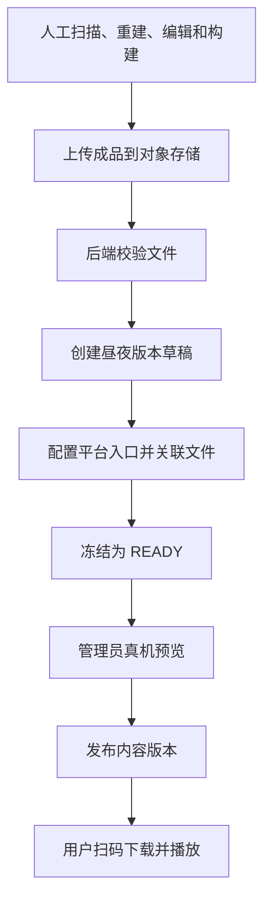

# V0.1 作业流设计

> 2026-09-16 更新：当前改为内网本地文件存储，见 [基础设施说明](10-local-infrastructure.md)。下文云直传、200 MiB、120 秒、昼夜发布等均是旧候选参数，不作为当前实现或验收要求。

> 本文保留 V0.1 候选设计与历史评审安排。当前 Demo 使用独立迁移，已实现范围以 [启动说明](08-demo-runbook.md) 为准；资源与发布流程尚未实现。

文件管理粒度待成品交付格式确认。本文涉及的平台文件关联、入口和依赖处理属于当前候选方案，确认后再定稿实现。

## 内容制作与发布

管理员完成预览后直接发布。预览发现内容问题时创建新草稿，冻结后的版本保持不变。

## 文件上传与校验

1. 客户端生成 `assetId`，提交文件类型、大小和 SHA256。同一 ID 对应相同元数据时复用记录，元数据不同时返回 `409`。
2. 后端创建 `PENDING` 记录，签发有效期为 15 分钟的临时上传凭证。客户端只能写入 staging 对象键。
3. 上传完成后，客户端携带对象版本号或 ETag 请求校验。后端在数据库事务外检查文件实际大小、SHA256、格式和路径安全。
4. 后端绑定同一对象版本读取并复制到不可覆盖的最终对象键，确认最终内容摘要，再通过短事务将状态更新为 `READY` 并记录审计。
5. 校验超时返回 `503`，记录保持 `PENDING`。客户端查询状态后重试。若最终文件已复制而数据库尚未提交，重试时检查该文件是否匹配，不能覆盖已有内容。

校验在当前请求内完成，使用独立且有并发上限的执行池。演示阶段暂定单文件上限为 200 MiB、同时校验最多 2 个文件、总时限为 120 秒，实际数值需要根据资源包测试调整。

同一 `assetId` 在应用内只允许一个校验过程执行，提交前再次锁定记录并检查状态。超时后不得继续提交数据库。服务重启后，由客户端查询状态并重试。

超过请求校验限制的文件，计划通过受控的服务器导入命令处理。导入命令复用文件验证和登记逻辑，并记录操作账号；该命令尚未实现。

## 版本操作

| 操作 | 处理方式 |
|---|---|
| 保存草稿 | 锁定版本行，检查 `expectedVersion`，在同一事务中更新配置与文件关联 |
| 冻结 | 检查平台格式、依赖、入口及文件状态，通过 `seal_version` 冻结并记录审计 |
| 发布或回滚 | 通过 `publish_version` 检查归属、文件和并发版本号，切换一个昼夜指针并记录审计 |
| 下线 | 将对应昼夜指针设为空；已开始的体验仍可请求曾发布的有效版本 |
| 撤销 | 将问题版本设为 `REVOKED`，停止签发清单；撤销共享文件会同时影响引用它的版本 |

发布状态由场景当前指针表示，内容版本保持 `READY`，便于再次选择并回滚。发布响应丢失时，客户端先查询当前指针；使用过期的 `expectedVersion` 重试会返回 `409`。

## 异常处理

| 情况 | 处理方式 |
|---|---|
| 上传中断 | 保留 `PENDING` 记录，由用户重传 |
| 文件损坏 | 标记为 `REJECTED`，使用新的 `assetId` 上传 |
| 入口或依赖缺失 | 拒绝冻结，继续编辑草稿 |
| 两人同时发布 | 一个请求成功，另一个收到 `409` 后重新查询 |
| 发布内容有误 | 回滚到可用版本，必要时撤销问题版本 |
| 数据库或存储不可用 | 返回错误，保持当前发布指针 |
| 手机定位丢失 | 客户端重新识别标记，保留原 `versionId` 并恢复坐标 |

下载签名暂定有效期为 10 分钟。撤销会停止签发新清单，但已签发的链接和离线缓存仍可能可用。紧急阻断需要配合存储或 CDN 操作。历史版本共享场景坐标原点，回滚不会改变标记对齐约定。
