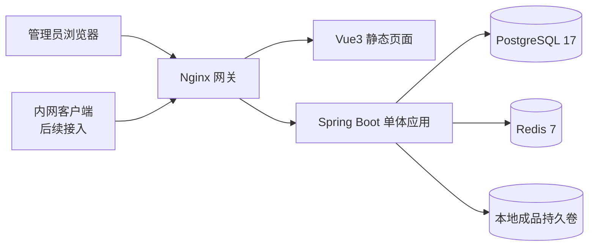
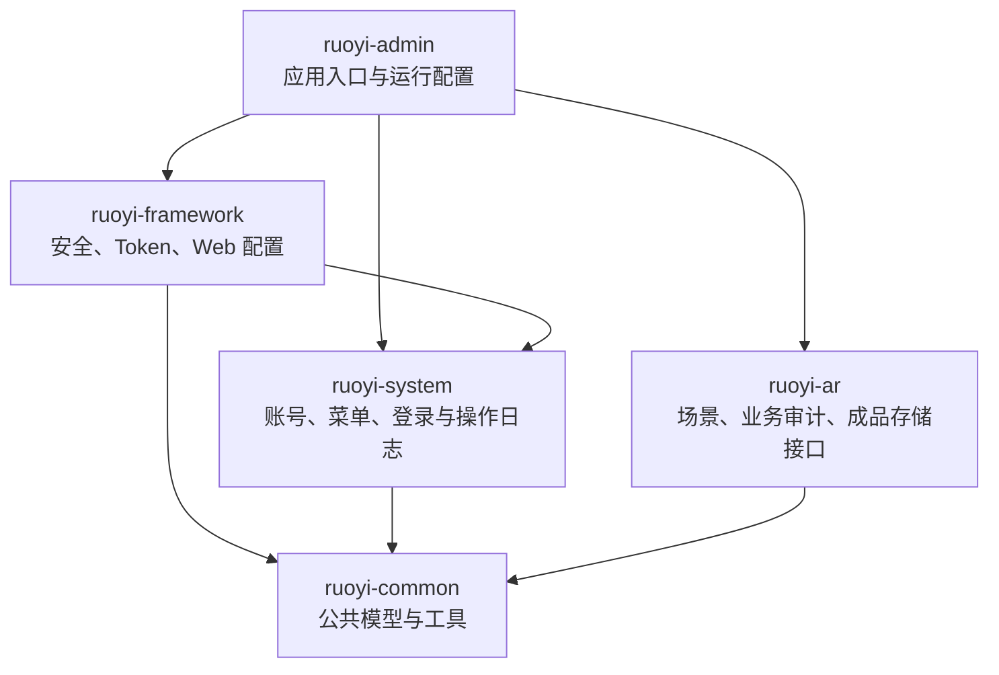
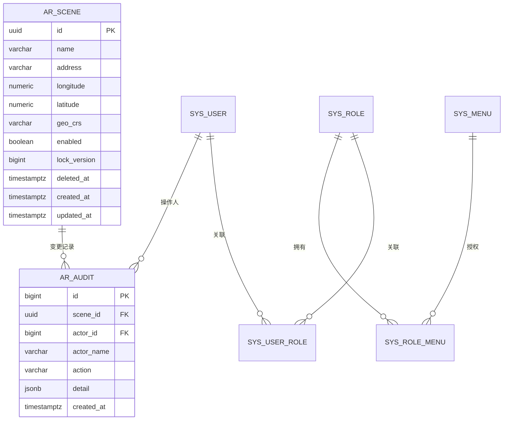
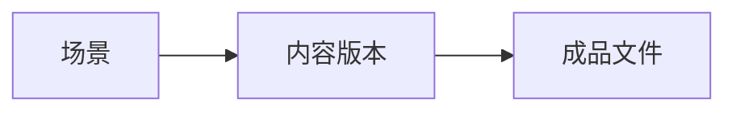
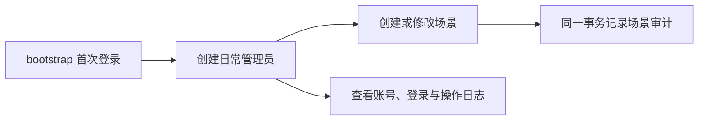

本文记录乌托邦世界后端平台当前采用的技术选型、数据边界、后端结构和内容作业流。文档以仓库代码和已经运行的 Docker 环境为依据，区分已经实现的能力和等待真实成品确认的设计。

当前阶段是内网 MVP。算法同学在工作站完成办公室扫描和成品处理，平台负责账号、场景、审计和本地文件存储基础能力，客户端负责下载后的加载与渲染。资源入库已实现，详见 [资源入库闭环](12-resource-ingestion.md)：场景下创建草稿，登记并上传多个文件，校验后可在后台查询。真实 Addressables 样包及客户端加载约定尚未提供，版本发布、回滚和客户端下载仍未实现。

## 已确定的架构边界

- 平台采用一个 Spring Boot 应用，不拆分微服务，也不增加任务队列或独立 Worker。
- PostgreSQL 保存业务数据和文件元数据，本地持久卷保存成品文件。数据库不保存文件内容、Windows 盘符、容器绝对路径或永久下载地址。
- 场景、内容版本和成品文件保持分离。本轮一个场景关联多个版本草稿，一个草稿关联多个独立文件；不解析包内文件或共享依赖。
- 算法处理和客户端渲染不进入后端。后端不调度扫描、重建或资源构建任务。
- 管理后台使用独立账号，当前账号具有相同管理员权限。系统不包含租户、审批角色或公开注册。
- 当前部署只面向团队内网。公网入口、HTTPS、CDN、高可用和自动备份不在本阶段范围内。

## 技术选型

| 层次 | 当前选择 | 使用范围 |
|---|---|---|
| 管理后台 | Vue 3.5.26、Vite 6.4.1、Element Plus 2.13.1、Axios 1.13.2 | 登录、账号、场景和日志页面 |
| 网关 | Nginx 1.28.0 Alpine | 提供前端静态资源，将 `/prod-api/` 转发到后端 |
| 后端 | Java 21、Spring Boot 3.5.16、RuoYi 3.9.2 | HTTP 接口、鉴权、业务事务和文件存储抽象 |
| 数据访问 | MyBatis 3.0.5、Druid 1.2.28 | PostgreSQL 查询、写入和事务管理 |
| 数据库 | PostgreSQL 17.6 | 账号、菜单、日志、场景和业务审计 |
| 数据库迁移 | Flyway | 按版本初始化和演进数据库结构 |
| 登录状态 | Spring Security、Bearer Token、Redis 7.4.5 | 保存短期登录状态并校验账号凭证版本 |
| 成品存储 | `ArtifactStorage`、Docker 本地命名卷 | 暂存、摘要校验、确认入库、读取和盘点 |
| 部署 | Docker Compose、Linux 容器 | Windows Docker Desktop 开发，后续迁移到 Linux 服务器 |

这套选型沿用现有若依后台的账号、菜单和日志能力，同时把项目业务集中在 `ruoyi-ar` 模块。当前业务规模不需要引入分布式组件。文件存储通过接口隔离，后续需要更换存储方式时，可以保留业务层的文件标识和状态定义。

## 部署架构

Docker Compose 管理 `gateway`、`backend`、`postgres` 和 `redis` 四个服务。当前运行入口是 `http://192.168.0.12:43174/`。只有网关映射宿主端口，PostgreSQL、Redis 和 Spring Boot 只在容器内部网络中通信。

网关同时连接 `edge` 和 `services` 网络，其他服务只连接 internal 类型的 `services` 网络。Nginx 不挂载成品卷，`/artifacts`、`/_artifacts`、`/staging`、`/committed` 和 `/data` 等内部路径直接返回 404。后续提供客户端下载时，后端需要先判断版本和文件是否可以访问，再把已授权的文件交给 Nginx 传输，不能开放原始目录。

PostgreSQL、成品、框架文件和后端日志分别使用命名卷。Redis 的 `/data` 使用 tmpfs，容器重启后登录状态失效，用户需要重新登录。应用配置和随机凭据保存在忽略提交的 `config/compose.env`，不会写入镜像。

## 后端平台架构

后端使用模块化单体结构。所有业务模块由一个 Spring Boot 进程加载，模块用于划分职责，不代表独立服务。

`ruoyi-admin` 负责应用启动、环境变量和 Flyway 迁移。`ruoyi-framework` 配置 Spring Security、Bearer Token、异常响应和 MyBatis 扫描。`ruoyi-system` 管理固定角色账号、菜单、登录日志与操作日志。`ruoyi-ar` 提供场景接口、场景业务审计和 `ArtifactStorage` 存储抽象。

当前安全配置只允许已经实现的接口通过。登录和验证码接口允许匿名访问；账号、日志、场景及场景审计接口要求管理员登录；其他请求默认拒绝。若依框架接口继续使用 `code/msg` 响应，`/api/v1` 业务接口使用真实 HTTP 状态和 `code/message/traceId` 错误结构。

首次部署使用 `bootstrap` 引导账号。管理员创建第一个日常账号以后，引导账号自动停用。日常账号统一关联固定管理员角色。密码长度为 12–64 个字符，系统禁止停用最后一个有效管理员。密码或账号状态发生变化时，数据库递增 `credential_epoch`，后端在每次请求中核对该版本，使旧 Token 失效。

账号列表支持确认后删除，通过 `DELETE /system/user/{id}` 将 `del_flag` 设为 `2` 并停用账号，保留账号行、场景审计和历史日志。旧登录凭证失效，账号不能重新启用或重置密码，已使用的账号名不重复使用。删除与账号启停共用固定角色行锁，禁止删除最后一个有效管理员及当前登录账号。已停用的引导账号可由其他管理员删除，删除操作记录在系统操作日志中。

## 数据库架构

当前 Docker 环境只加载 `classpath:db/demo` 下的 Flyway 迁移。根目录 `database/migrations` 保存旧七表候选设计，不参与应用初始化。

数据库可以分为框架数据和当前业务数据两部分：

| 数据范围 | 主要表 | 当前职责 |
|---|---|---|
| 账号与权限 | `sys_user`、`sys_role`、`sys_menu`、`sys_user_role`、`sys_role_menu` | 管理员、固定角色和后台菜单 |
| 登录与系统日志 | `sys_logininfor`、`sys_oper_log` | 登录结果和已接入的后台管理操作 |
| 框架配置 | `sys_config`、字典、部门及其他若依基础表 | 支撑后台框架运行 |
| 场景 | `ar_scene` | 场景名称、地址、可选经纬度、启用状态和并发版本号 |
| 场景审计 | `ar_audit` | 记录场景变更的操作人、动作、时间及变更内容 |

`ar_scene.lock_version` 用于乐观并发控制。修改场景时，客户端必须提交读取到的版本号；版本号过期时返回 409，防止后提交的请求直接覆盖他人的修改。经纬度必须同时填写，并同时指定 `WGS84`、`GCJ02` 或 `BD09` 坐标类型。

场景列表支持删除，操作前弹出包含场景名称的确认窗口。`DELETE /api/v1/scenes/{id}?expectedVersion=...` 需要登录，成功返回 204。V006 迁移增加 `deleted_at`，用于逻辑删除；已删除场景不再出现在列表和详情中，也不能修改或启用。删除沿用修订号检查，并在同一事务内写入 `DELETE` 审计，保留历史记录。

场景修改与 `ar_audit` 写入处于同一个数据库事务中。审计表通过触发器禁止更新和删除，业务变更和审计记录不能只提交其中一项。账号表通过触发器维护 `credential_epoch`，密码或启用状态变化后，已经签发的 Token 不能继续使用。

数据库中的时间字段使用 `timestamptz`，应用和容器使用 UTC。页面展示时再根据客户端时区处理。

### 后续业务数据边界

后续仍然保留以下三层业务对象，但目前不确定物理表、字段和文件关联数量：

- 场景表示办公室等长期存在的业务对象。
- 内容版本表示一次可以预览、发布和回滚的交付结果。
- 成品文件保存客户端实际需要加载的内容，数据库只保存文件标识、大小、SHA256 和业务状态。

成品交付格式尚未确定。一个完整包和入口文件加依赖文件集合都是待验证的交付方式。取得样包和客户端加载说明以后再决定依赖模型；旧设计中的昼夜字段、平台文件集合和坐标规则暂不进入当前实现。

## 本地成品存储

`ArtifactStorage` 定义暂存、确认入库、重新校验、读取和盘点五类操作。首个实现 `LocalArtifactStorage` 使用同一个本地文件系统中的 `staging`、`committed` 和 `locks` 目录。

1. 写入时先生成 `<uuid>.part`，边读取边计算文件大小和 SHA256。
2. 校验通过以后，文件原子重命名为 `<uuid>.ready`。校验失败或输入中断时，不会生成正式文件。
3. 确认入库时重新校验暂存文件，再通过硬链接生成 `committed/<uuid>.bin`，最后删除 `.ready`。
4. 同一个 UUID 和相同元数据可以安全重试；不同元数据或已有文件损坏时拒绝继续处理。
5. 服务重启后可以盘点 `.part`、`.ready` 和 `.bin`，识别未完成的操作。组件不会自行删除正式文件，也不会根据文件存在推断业务版本已经发布。

文件系统操作和数据库事务不能组成同一个原子事务。资源模块接入以后，数据库需要保存明确的处理状态，并在重试或服务重启时根据文件盘点结果对账。文件进入 `committed` 目录只表示内容完整，不表示文件已经登记、发布或允许客户端下载。

## 当前管理作业流

首次部署后，团队使用私密配置中的引导密码登录。创建第一个日常管理员以后，`bootstrap` 停用。管理员可以创建、修改、启用或停用场景，并查看场景操作记录。账号管理动作写入若依操作日志，登录结果写入登录日志；场景业务变化单独写入 `ar_audit`。

## 目标内容作业流

目标流程用于指导下一阶段实现。只有本地存储组件已经落地，其余步骤需要真实成品和客户端联调以后再确定接口与数据库结构。

```mermaid
flowchart LR
    Scan[办公室扫描] --> Process[算法工作站处理]
    Process --> Upload[管理员手动上传成品]
    Upload --> Stage[写入暂存区]
    Stage --> Verify[校验大小与 SHA256]
    Verify --> Commit[确认成品文件]
    Commit --> Draft[建立内容版本草稿]
    Draft --> Preview[人工预览确认]
    Preview --> Publish[切换当前发布版本]
    Publish --> Manifest[客户端请求版本清单]
    Manifest --> Download[下载已授权成品]
    Download --> Render[客户端校验并渲染]
```

### 成品交付

算法工作站只负责生产交付物，不直接写入平台存储目录。首期通过管理后台人工上传，上传接口保持独立，后续可以由工作站脚本复用。后端根据客户端提交的预期大小和 SHA256 校验实际文件，不能只相信请求元数据。

资源入库先创建版本草稿，再登记待上传文件并建立关联；原始文件经过大小与 SHA256 校验、正式存储确认和重新校验后，数据库才标记可用。文件校验、文件确认和数据库状态提交需要支持重复请求。服务重启以后，平台根据数据库状态和存储盘点结果处理未完成记录，不通过后台队列继续未知任务。

### 预览、发布与回滚

管理员确认内容版本包含完整成品以后，才能把它标记为可预览状态。预览通过后，发布操作把场景的当前版本切换到目标版本。发布不覆盖旧文件，回滚时只切换回已经确认的历史版本。

发布操作需要携带并发版本号。两个管理员同时发布时，只允许一个请求成功，另一个请求收到 409 后重新读取当前状态。已经开始下载或播放的客户端固定使用同一个内容版本，不能在一次体验中混合新旧文件。

### 客户端获取

内网客户端不登录管理账号，只能请求已经发布且没有撤销的内容。后端返回带协议版本、内容版本标识、文件大小、SHA256 和下载地址的清单。客户端先固定版本，再依次下载文件，校验摘要后交给本地渲染模块。

客户端下载由后端判断访问资格，Nginx 负责实际文件传输。正式实现需要支持 HTTP Range，并使用真实包体验证中断续传。撤销文件或版本以后，平台停止签发新的下载权限，但不能收回客户端已经下载的内容。

## 异常处理原则

| 情况 | 处理原则 |
|---|---|
| 上传中断 | 文件不能进入正式目录；相同 UUID 可以重新上传 |
| 大小或摘要不符 | 拒绝确认文件，保留明确的失败状态 |
| 磁盘空间不足 | 返回失败，不提交文件可用状态 |
| 文件已确认、数据库未提交 | 重试时核对文件内容，再补交数据库状态 |
| 数据库已登记、文件不可用 | 禁止建立可发布版本，并进入人工处理 |
| 并发编辑或发布 | 使用 `lock_version` 检查，过期请求返回 409 |
| 发布内容有误 | 切换回已确认的历史版本，不覆盖当前文件 |
| Redis 重启 | 登录状态失效，管理员重新登录 |
| PostgreSQL 或存储不可用 | 保留当前发布状态，不继续提交新状态 |

## 部署与迁移

Windows 阶段使用 Docker Desktop 的 Linux 容器。迁移到 Linux 服务器时继续使用相同的 Compose 服务关系和环境变量，不复制容器的可写层。

迁移时先停止网关和后端写入，通过 `pg_dump` 导出 PostgreSQL，再复制成品卷并记录相对路径、大小和 SHA256。目标环境恢复数据库和文件以后，需要核对场景、审计、文件摘要和发布关系，再使用真实客户端完成加载测试。源环境在验收完成以前保持停止并保留数据，以便迁移失败时退回。

当前只验证了命名卷在容器重建以后继续保留数据。物理主机迁移、备份恢复、磁盘写满、断电和多设备并发尚未验收。

## 当前状态与下一步输入

已经实现并验证的内容包括 Docker Compose、管理后台、管理员账号、登录与操作日志、场景管理、场景审计、本地存储组件和容器重建后的数据持久性。

继续实现资源和发布模块以前，需要取得以下输入：

- 一份可以被目标客户端加载的真实成品。
- 客户端技术栈、加载步骤和支持的运行环境。
- 成品包含一个文件还是多个关联文件。
- 典型文件大小、最大文件大小和同时下载设备数量。
- 是否需要现场 AR 对齐、普通三维浏览或两种体验。
- 是否存在昼夜、主题等需要同时保留的内容变体。

本轮已确定最小草稿与文件元数据表和可配置上传上限；这些信息确认以后，再确定客户端清单、依赖关系、下载路径和发布规则。
